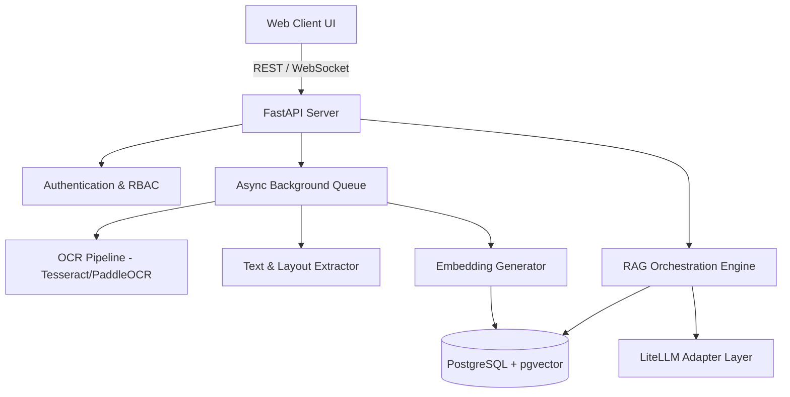

# High-Level System Architecture

## System Components
1. **Frontend Workspace**: Split-screen viewer, chat interface, timeline graph, verification panels.
2. **Core API Service**: Handles matter management, document ingestion workflows, RBAC enforcement.
3. **Ingestion & OCR Pipeline**: Converts uploaded PDFs into clean Markdown/text chunks with page bounding box coordinates.
4. **Hybrid Search & Vector Store**: PostgreSQL storing document metadata, raw text, entity extractions, and 1536-dim vector embeddings.
5. **RAG & Citation Engine**: Constructs prompts with explicit snippet metadata; validates returned citations before sending to client.
