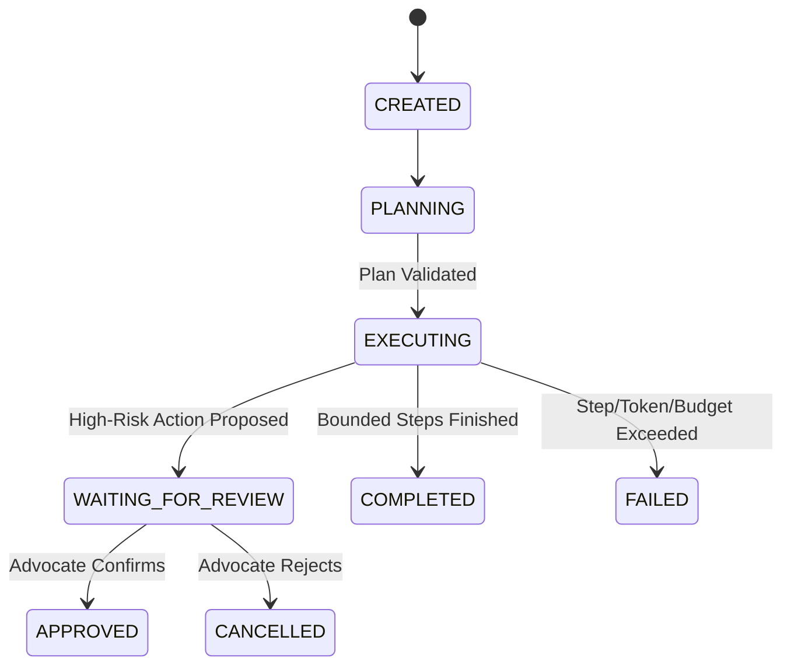

# Governed Agent Architecture & Execution State Machine

## Agent Execution State Machine

---

## Non-Negotiable Limits
- **Max Steps**: 5 execution steps per agent run.
- **Max Tool Calls**: 8 tool calls total.
- **Max Execution Time**: 30 seconds limit.
- **Max Token Budget**: 15,000 tokens per agent invocation.
