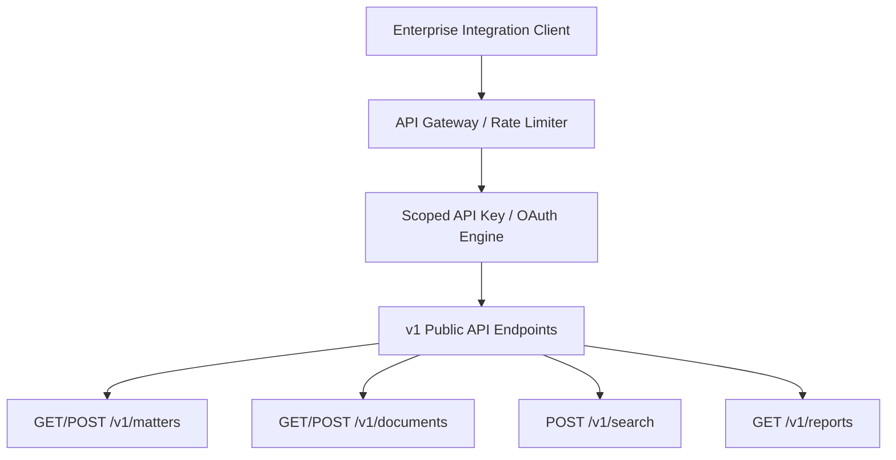

# Public API Boundary & Scoped Endpoints Catalog

## Public API Boundary Architecture

---

## Public API Endpoints Catalog (v1.0.0)

| HTTP Method | API Path | Required Scope | Rate Limit | Description |
| :--- | :--- | :--- | :---: | :--- |
| **GET** | `/v1/matters` | `matter:read` | 600 RPM | List organization legal matters |
| **POST** | `/v1/documents/upload` | `document:write` | 60 RPM | Ingest PDF title deeds into processing queue |
| **POST** | `/v1/search` | `search:read` | 300 RPM | Execute RRF hybrid search over matter evidence |
| **POST** | `/v1/webhooks/subscriptions`| `admin:write` | 60 RPM | Register HMAC signed webhook destination URL |

Internal database schemas are never exposed via the public API layer.
