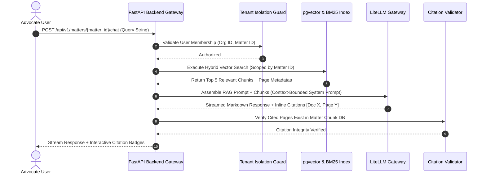

# RAG & Citation Architecture Specification

## RAG Sequence Diagram

---

## Application-Level Citation Validation Layer
- **Rule**: The LLM is NEVER the final authority on citation validity.
- **Validation Engine**: Backend inspects every returned citation tag `[Doc X, Page Y]`:
  1. Checks if `doc_id=X` belongs to `matter_id`.
  2. Verifies `page_number=Y` is within `doc.page_count`.
  3. Validates text snippet overlap against `document_pages.raw_ocr_text`.
  4. If invalid, transforms badge to `[Citation Unverified]` alert state.
