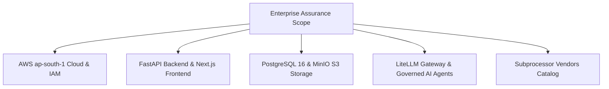

# Enterprise Control Assurance Program & Scope

## Assurance Scope & Boundaries

---

## Assurance Principles
1. **Evidence Over Claims**: Written policy is insufficient; every control requires dateable, reproducible technical evidence.
2. **Truthful Certification Status**: Explicitly distinguish `CERTIFICATION_READY` (Internal verification complete) from `CERTIFIED` (Independent third-party audit completed).
3. **Continuous Verification**: Controls tested automatically in CI/CD and security regression suites on every build.
