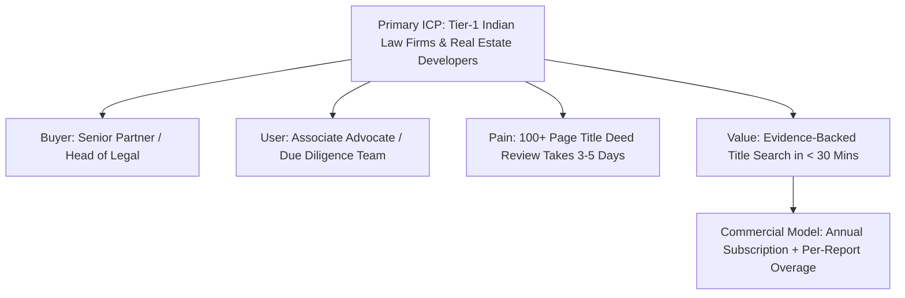

# Go-To-Market Commercial Strategy & Ideal Customer Profile

## Target Market & Ideal Customer Profile (ICP)

---

## ICP Characteristics
- **Organization Type**: Law Firms (10+ Advocates) and Real Estate Developers in Maharashtra, Karnataka, NCR.
- **Workflow**: High volume of Property Title Due Diligence & Search Report Generation.
- **Document Volume**: 50+ PDF title deeds per month (including scanned handwritten 7/12 extracts, sale deeds, & tax receipts).
- **Buying Trigger**: Delayed property transaction closings due to manual due diligence bottlenecks.
