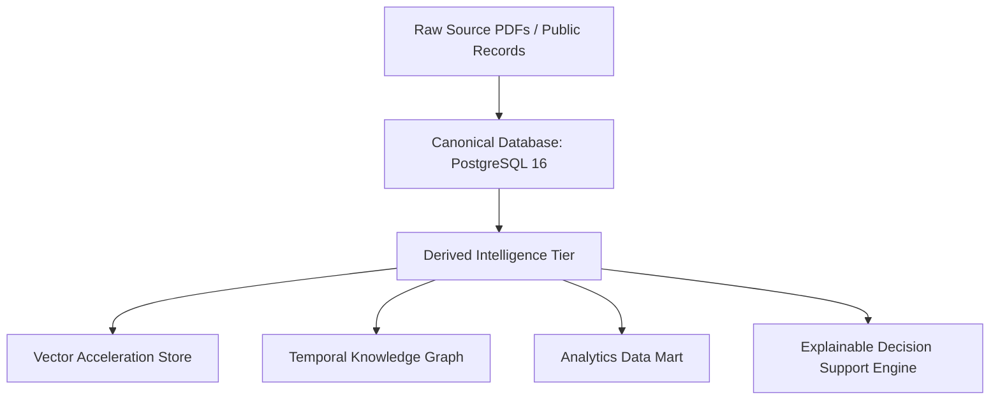

# Data Intelligence Layer Architecture

## Data Tier Separation

---

## Tier Principles
1. **Canonical Tier**: Authoritative ground-truth data (documents, matter metadata, RBAC memberships).
2. **Derived Tier**: AI-generated summaries, extracted entities, and vector embeddings. Derived objects MUST reference canonical source ID and page locator.
3. **Analytics Tier**: Aggregated product usage and matter progress metrics. Strictly tenant-isolated.
