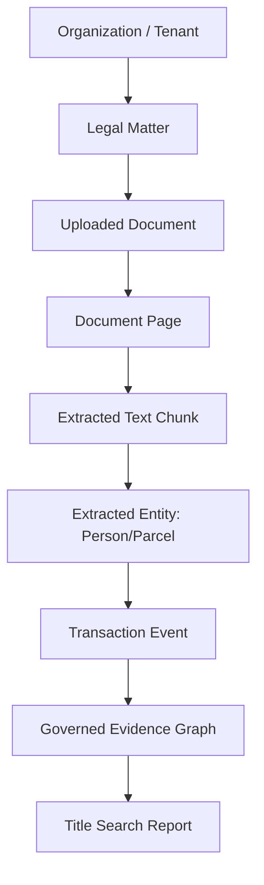

# Data Domain Map & Entity Scoping

## Data Domain Entity Map

---

## Entity Domain Boundaries

| Entity Domain | Primary Key | Owner Scope | Canonical Source | Tenant Scoped |
| :--- | :--- | :--- | :--- | :---: |
| **Organization** | `org_id` | Tenant Root | Authenticated Session | YES |
| **Matter** | `matter_id` | Organization | PostgreSQL `matters` | YES |
| **Document** | `document_id` | Matter | Object Storage S3 | YES |
| **Document Page** | `page_id` | Document | PostgreSQL `document_pages` | YES |
| **Entity (Party/Parcel)**| `entity_id` | Matter / Property | Extracted OCR / Land Registry | YES |
| **Knowledge Graph Edge** | `edge_id` | Property / Matter | `EvidenceGraphEngine` | YES |
