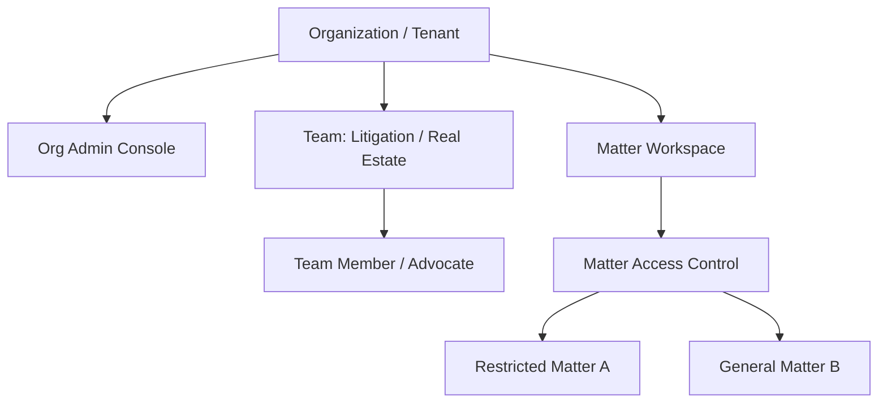

# Organization Hierarchy & Membership Lifecycle

## Organization Domain Hierarchy

---

## Member Lifecycle States
- **`INVITED`**: Email invitation token sent; access blocked until acceptance.
- **`ACTIVE`**: Full access granted according to assigned Organization and Matter roles.
- **`SUSPENDED`**: Temporary access pause; all active sessions & token refreshes revoked.
- **`DEACTIVATED`**: Permanent account closure; user removed from all matter workspaces.
