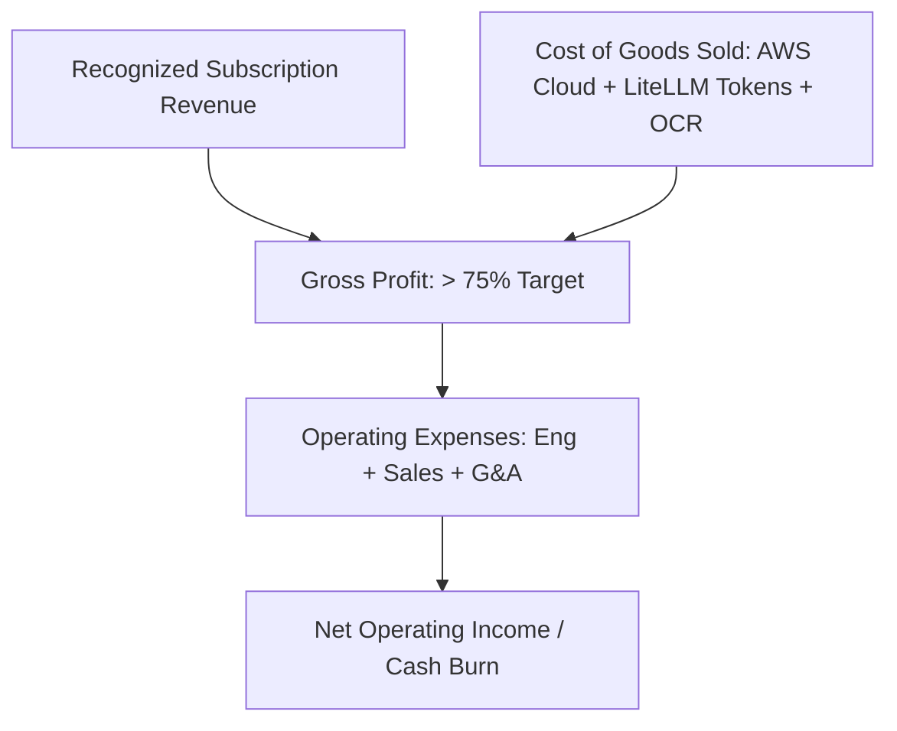

# SaaS Financial Operating Model & Revenue Recognition

## Financial Architecture & P&L Structure

---

## Revenue Recognition Principles
1. **ASC 606 / Ind AS 115 Compliance**: Subscription revenue recognized ratably over the contract term (e.g., 1/12th per month for annual plans).
2. **Upfront Bookings**: Cash collected upfront recorded as `Deferred Revenue` liability until recognized.
3. **Usage Overages**: Per-report overage fees recognized in the month the usage occurs (`FIN-001`).
