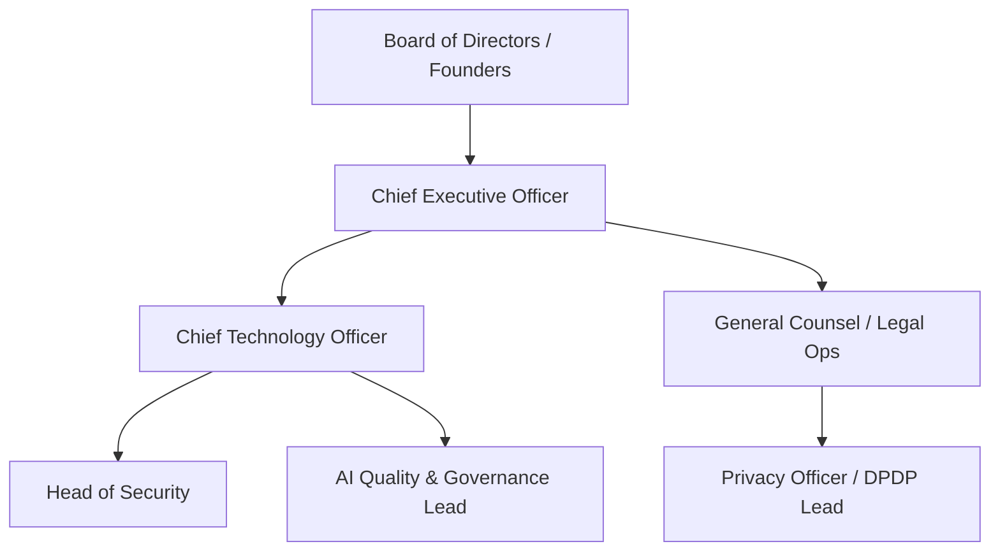

# Executive Governance Model & Decision Rights

## Executive Governance Structure

---

## Decision Rights Matrix

| Decision Type | Authorized Approver | Escalation Threshold |
| :--- | :--- | :--- |
| **High-Risk AI Model Deployment** | CTO + Legal Lead | Any change to legal due diligence extraction prompts |
| **Production Infrastructure Changes**| Lead SRE | Any modification affecting AWS `ap-south-1` data residency |
| **Vendor / Subprocessor Selection** | CTO + Security Lead | Any vendor receiving customer PDF title deed data |
| **Customer MSA / SLA Exceptions** | General Counsel | Any custom data retention or deletion terms |

Every decision MUST record explicit owner, timestamp, and audit trail.
