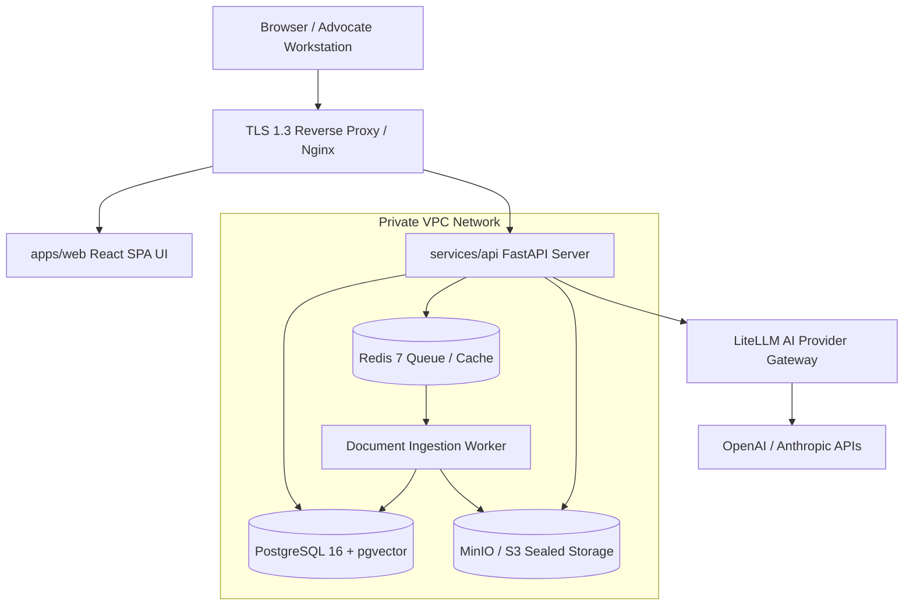

# Production Deployment Architecture

## System Topography

---

## Data Boundary Isolation
- **Public Boundary**: HTTPS Port 443 only.
- **Private Subnet**: PostgreSQL (Port 5432), Redis (Port 6379), S3 Storage (Port 9000). Direct public internet exposure is strictly blocked.
