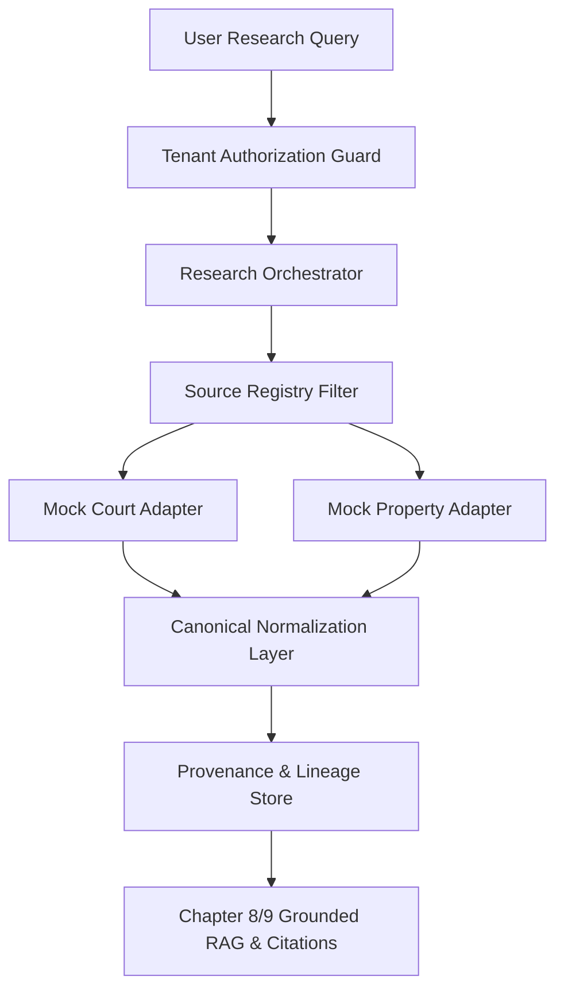

# External Research Architecture & Source Selection Policy

## Research Pipeline Flow

```mermaid
graph TD
    UserQuery[User Research Query] --> AuthGuard[Tenant Authorization Guard]
    AuthGuard --> Orchestrator[Research Orchestrator]
    Orchestrator --> SourceReg[Source Registry Filter]
    
    SourceReg --> MockCourt[Mock Court Adapter]
    SourceReg --> MockProp[Mock Property Adapter]
    
    MockCourt --> Normalizer[Canonical Normalization Layer]
    MockProp --> Normalizer
    
    Normalizer --> ProvenanceStore[Provenance & Lineage Store]
    ProvenanceStore --> RAGPipeline[Chapter 8/9 Grounded RAG & Citations]
```
