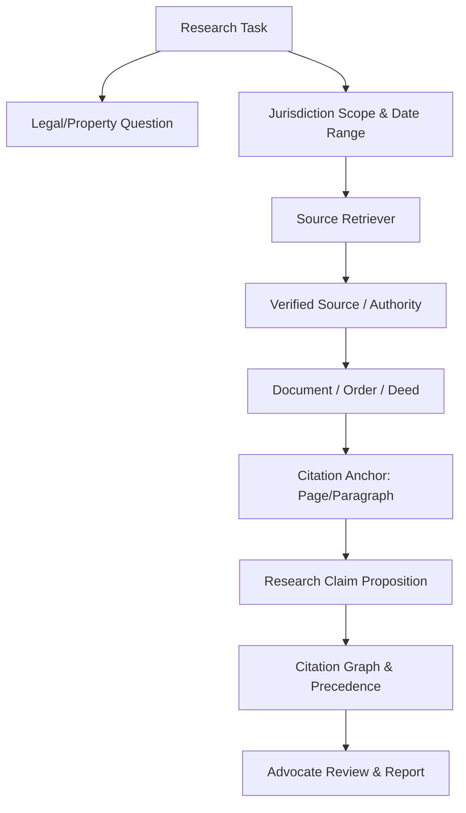

# Research Domain Model & Entity Relationships

## Research Domain Model & Relationships

---

## Entity Domain Specifications

| Entity Name | Primary Key | Canonical Source | Description |
| :--- | :--- | :--- | :--- |
| **Research Task** | `task_id` | `matters` Table | Scoped research task tied to a specific legal matter |
| **Source Authority** | `source_id` | `source_registry` | Primary (Court/Registry) vs Secondary Authority |
| **Citation Anchor** | `citation_id` | Document PDF Page | Bounding box locator in stored source document |
| **Research Claim** | `claim_id` | AI / Extraction Engine | Proposition status (`SUPPORTED`, `CONTRADICTED`, `UNVERIFIED`) |
| **Citation Edge** | `edge_id` | Citation Graph | Precedent relationship (`CITES`, `FOLLOWS`, `DISTINGUISHES`, `OVERRULES`) |
