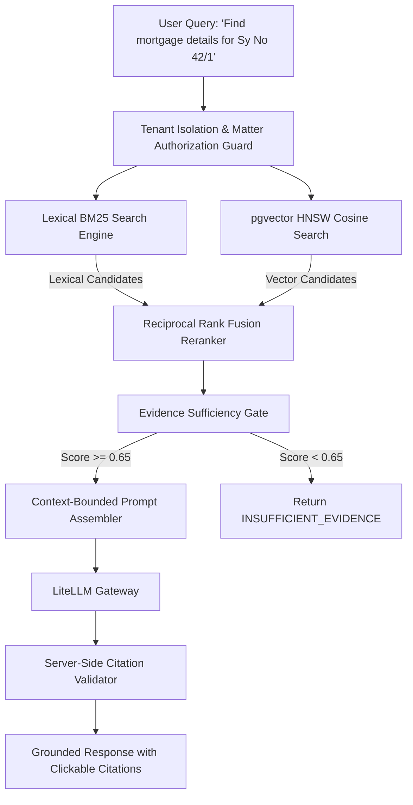

# Search & Hybrid RAG Architecture

## Search Retrieval Pipeline

---

## Derived Data Model Rule
The PostgreSQL database, raw OCR pages, and immutable source PDFs are the sole canonical truth. Vector embeddings and full-text indexes are **derived data artifacts** that can be completely wiped and reconstructed at any time using `python -m app.search.rebuild`.
